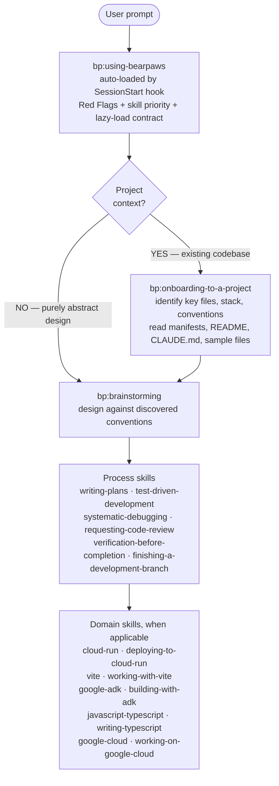

# Bearpaws

> **A hard fork of [superpowers](https://github.com/obra/superpowers) v5.0.7 by Jesse Vincent and contributors (MIT).** Bearpaws preserves the original license and credits the upstream authors; it is not affiliated with or endorsed by the superpowers project.

A Claude Code (and Gemini CLI) skills plugin focused on **token-efficiency** — delivering the same behavioral performance as superpowers while significantly reducing per-session token consumption.

**25 skills** covering TDD, debugging, planning, code review, parallel execution, plus a stack-agnostic onboarding skill and domain knowledge for Google Cloud, Google ADK, Vite, JS/TypeScript, and Cloud Run. All skill bodies use a structured XML schema with lazy-loaded references.

**How skills compose.** Standard flow when there's a project: (1) `bp:onboarding-to-a-project` identifies key files and stack from manifests, README, and similar files; (2) `bp:brainstorming` designs against those discovered conventions; (3) other process skills (writing-plans, TDD, debugging, code review) carry implementation; (4) domain skills (`cloud-run`, `vite`, `google-adk`, etc.) layer on as needed. Onboarding → brainstorming → implementation. Onboarding is skipped only for purely abstract design questions with no project context.



## Install (Claude Code)

You can install the plugin via the Claude Code CLI:

```bash
claude plugin marketplace add /path/to/bearpaws
claude plugin install bp@bearpaws-dev
```

Or pass it on the command line without installing: `claude --plugin-dir /path/to/bearpaws`.

## Install (Gemini CLI)

You can install the plugin via the Gemini CLI:

```bash
gemini extensions install /path/to/bearpaws
```

Or link it for local development so updates are reflected immediately: `gemini extensions link /path/to/bearpaws`.

## Skills

### Bootstrap (1)

| Skill | Purpose |
|---|---|
| `bp:using-bearpaws` | Auto-loaded by the `SessionStart` hook. Establishes skill-discovery discipline (Red Flags, lazy-load contract, skill-priority order). Never invoked directly. |

### Always-first (1)

| Skill | Purpose |
|---|---|
| `bp:onboarding-to-a-project` | **First on any work that touches the codebase.** Detect stack from manifests, read CLAUDE.md/AGENTS.md, sample existing files, find the test command. Skipped for pure ideation. |

### Process skills (13)

| Skill | Purpose |
|---|---|
| `bp:brainstorming` | Structured brainstorming before creative work |
| `bp:writing-plans` | Write implementation plans from specs |
| `bp:executing-plans` | Execute implementation plans step by step |
| `bp:test-driven-development` | TDD workflow: RED → GREEN → REFACTOR |
| `bp:systematic-debugging` | Root-cause debugging methodology |
| `bp:verification-before-completion` | Verify work before claiming completion |
| `bp:requesting-code-review` | Request code review from the reviewer agent |
| `bp:receiving-code-review` | Process and apply code review feedback |
| `bp:finishing-a-development-branch` | Ship a branch: rebase, squash, PR |
| `bp:subagent-driven-development` | Multi-agent development with spec/impl/review |
| `bp:dispatching-parallel-agents` | Run independent tasks via parallel subagents |
| `bp:using-git-worktrees` | Isolate feature work in git worktrees |
| `bp:writing-skills` | Author and test new skills (meta) |

### Domain skills (10)

| Skill | Type | Technology |
|---|---|---|
| `bp:google-cloud` | reference | Google Cloud Platform |
| `bp:working-on-google-cloud` | workflow | Google Cloud Platform |
| `bp:google-adk` | reference | Google Agent Development Kit |
| `bp:building-with-adk` | workflow | Google Agent Development Kit |
| `bp:vite` | reference | Vite |
| `bp:working-with-vite` | workflow | Vite |
| `bp:javascript-typescript` | reference | JavaScript / TypeScript |
| `bp:writing-typescript` | workflow | TypeScript |
| `bp:cloud-run` | reference | Cloud Run |
| `bp:deploying-to-cloud-run` | workflow | Cloud Run |

## Token efficiency

Bearpaws delivers the same skill-triggering reliability as superpowers with significantly less context:

| Metric | superpowers v5.0.7 | Bearpaws v1.1.0 | Delta |
|---|---:|---:|---|
| Bootstrap injected per session | 5,292 bytes (~1,323 tokens) | 4,295 bytes (~1,022 tokens) | -19% bytes / -23% tokens |
| Process skill bodies (14, apples-to-apples) | 108,393 bytes (~27,098 tokens) | ~53,800 bytes (~12,800 tokens) | -50% bytes / -53% tokens |
| All SKILL.md (now 25 skills, +11 net-new) | — | 101,579 bytes (~24,200 tokens) | net-new domain + onboarding skills add coverage |
| Skills | 14 | 25 | +79% |

Token counts measured with `tiktoken` `cl100k_base` as a proxy for Anthropic's tokenizer. Byte and token reductions stay within ~2 percentage points of each other across the suite. The bootstrap is paid every session; non-bootstrap skills load on-demand via the `Skill` tool.

## Tests

```bash
tests/skill-triggering/run-all.sh                     # ~2 min — naive-prompt triggering
tests/claude-code/run-skill-tests.sh                   # ~2 min — fast skill-content tests
tests/claude-code/run-skill-tests.sh --integration     # 10–30 min — full integration suite
tests/schema-validator/run-validator.sh                # <1 sec — XML tag whitelist enforcement
tests/token-measurement/measure.sh                     # <1 sec — byte counts (JSON output)
```

## Attribution

Bearpaws is a hard fork of **[superpowers](https://github.com/obra/superpowers)** at v5.0.7 by Jesse Vincent and contributors, released under the MIT license. The Bearpaws fork preserves the same license and credits the original authors. Design spec and release history are in [docs/bearpaws/](docs/bearpaws/).

## License

MIT — see [LICENSE](LICENSE).
