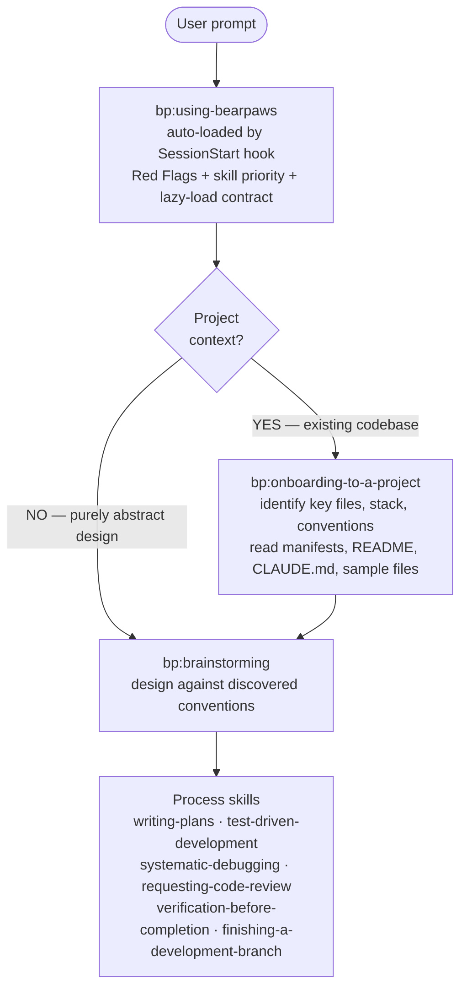

# Bearpaws

> **A hard fork of [superpowers](https://github.com/obra/superpowers) v5.0.7 by Jesse Vincent and contributors (MIT).** Bearpaws preserves the original license and credits the upstream authors; it is not affiliated with or endorsed by the superpowers project.

A Claude Code (and Gemini CLI) skills plugin. Our goal is to **mitigate token usage and enforce token efficiency** — preserving the behavioral performance of upstream superpowers while keeping per-session context as lean as we can manage.

**15 skills** covering TDD, debugging, planning, code review, parallel execution, plus a stack-agnostic onboarding skill. All skill bodies use a structured XML schema with lazy-loaded references.

**How skills compose.** Standard flow when there's a project: (1) `bp:onboarding-to-a-project` identifies key files and stack from manifests, README, and similar files; (2) `bp:brainstorming` designs against those discovered conventions; (3) other process skills (writing-plans, TDD, debugging, code review) carry implementation. Onboarding → brainstorming → implementation. Onboarding is skipped only for purely abstract design questions with no project context.



## Install (Claude Code)

You can install the plugin via the Claude Code CLI:

```bash
claude plugin marketplace add /path/to/bearpaws
claude plugin install bp@bearpaws
```

Or pass it on the command line without installing: `claude --plugin-dir /path/to/bearpaws`.

## Install (Gemini CLI)

You can install the plugin via the Gemini CLI:

```bash
gemini extensions install /path/to/bearpaws
```

Or link it for local development so updates are reflected immediately: `gemini extensions link /path/to/bearpaws`.

## Install (Devin for Terminal & Windsurf Cascade)

**Quick install (recommended):**

```bash
# Install for both platforms
./install.sh --all

# Or install for specific platforms
./install.sh --devin      # Devin for Terminal only
./install.sh --windsurf   # Windsurf Cascade only

# Global installation for Devin (available in all projects)
./install.sh --devin --global
```

The install script automatically creates the necessary symlinks and sets up the bootstrap rules. The repository is now "ready out of the box" — no manual setup required.

**Manual install (if you prefer):**

For Devin for Terminal:
```bash
mkdir -p .devin/skills
for skill in skills/*/; do
  ln -sfn "$skill" ".devin/skills/$(basename "$skill")"
done
```

For Windsurf Cascade:
```bash
mkdir -p .windsurf/skills
for skill in skills/*/; do
  ln -sfn "$skill" ".windsurf/skills/$(basename "$skill")"
done
# Bootstrap rule is already included via @include
```

The `using-bearpaws` skill bootstraps the rest — both platforms will invoke it autonomously at session start. SessionStart hooks are included for working in the bearpaws repo itself.

## Skills

### Bootstrap (1)

| Skill | Purpose |
|---|---|
| `bp:using-bearpaws` | Auto-loaded by the `SessionStart` hook. Establishes skill-discovery discipline (Red Flags, lazy-load contract, skill-priority order). Never invoked directly. |

### Always-first (1)

| Skill | Purpose |
|---|---|
| `bp:onboarding-to-a-project` | **First on any work that touches the codebase.** Detect stack from manifests, read CLAUDE.md/AGENTS.md, sample existing files, find the test command. Skipped for pure ideation. |

### Process skills (13)

| Skill | Purpose |
|---|---|
| `bp:brainstorming` | Structured brainstorming before creative work |
| `bp:writing-plans` | Write implementation plans from specs |
| `bp:executing-plans` | Execute implementation plans step by step |
| `bp:test-driven-development` | TDD workflow: RED → GREEN → REFACTOR |
| `bp:systematic-debugging` | Root-cause debugging methodology |
| `bp:verification-before-completion` | Verify work before claiming completion |
| `bp:requesting-code-review` | Request code review from the reviewer agent |
| `bp:receiving-code-review` | Process and apply code review feedback |
| `bp:finishing-a-development-branch` | Ship a branch: rebase, squash, PR |
| `bp:subagent-driven-development` | Multi-agent development with spec/impl/review |
| `bp:dispatching-parallel-agents` | Run independent tasks via parallel subagents |
| `bp:using-git-worktrees` | Isolate feature work in git worktrees |
| `bp:writing-skills` | Author and test new skills (meta) |

## Token efficiency

Our aim is to mitigate token usage and enforce token efficiency: keep skill-triggering reliability close to superpowers while shrinking the context footprint each session pays for. The numbers below are approximations from a single point-in-time measurement against superpowers v5.0.7 and will drift as either project changes — treat them as direction, not commitments.

| Metric | superpowers v5.0.7 | Bearpaws | Approx. delta |
|---|---:|---:|---|
| Bootstrap injected per session | ~5.3 KB (~1.3K tokens) | ~4.3 KB (~1.0K tokens) | ~20% smaller |
| Process skill bodies (apples-to-apples subset) | ~108 KB (~27K tokens) | ~54 KB (~13K tokens) | roughly half |

Token counts measured with `tiktoken` `cl100k_base` as a proxy for Anthropic's tokenizer; treat them as ballpark figures, not exact savings. The bootstrap is paid every session; non-bootstrap skills load on demand via the `Skill` tool, so the dominant cost is the bootstrap plus whatever skills the agent actually pulls in.

## Tests

```bash
tests/skill-triggering/run-all.sh                     # ~2 min — naive-prompt triggering
tests/claude-code/run-skill-tests.sh                   # ~2 min — fast skill-content tests
tests/claude-code/run-skill-tests.sh --integration     # 10–30 min — full integration suite
tests/schema-validator/run-validator.sh                # <1 sec — XML tag whitelist enforcement
tests/token-measurement/measure.sh                     # <1 sec — byte counts (JSON output)
```

## Attribution

Bearpaws is a hard fork of **[superpowers](https://github.com/obra/superpowers)** at v5.0.7 by Jesse Vincent and contributors, released under the MIT license. The Bearpaws fork preserves the same license and credits the original authors. Release notes are in [docs/bearpaws/release-notes/](docs/bearpaws/release-notes/).

## License

MIT — see [LICENSE](LICENSE).
