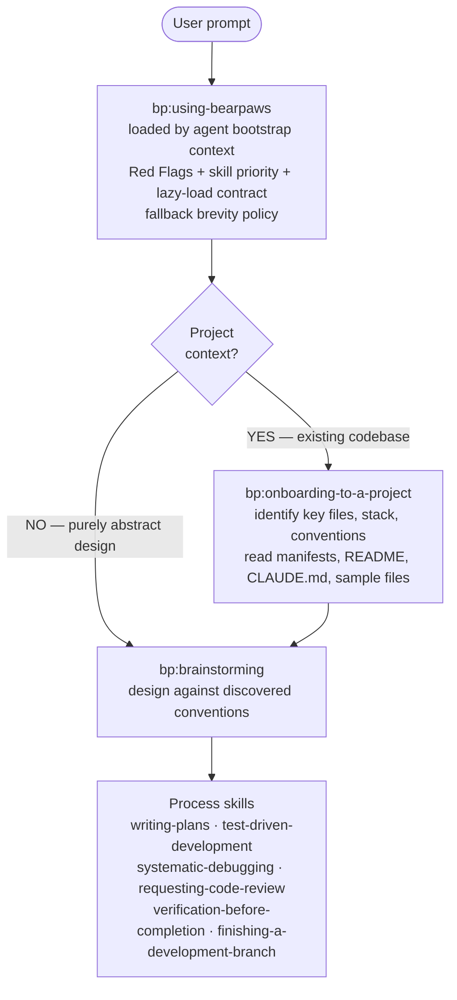

# Bearpaws

Bearpaws is an independent, low-token skills toolkit for AI coding agents, focused on portability, simplicity, and practical agent support. See [Attribution](#attribution) for the project's origin and license.

Claude Code and Gemini CLI are the primary supported targets. Codex, Devin for Terminal, and Windsurf Cascade support is experimental unless explicitly validated for a given workflow.

**15 skills** covering TDD, debugging, planning, code review, parallel execution, plus a stack-agnostic onboarding skill. All skill bodies use a compact XML-like structure with lazy-loaded references.

**How skills compose.** Standard flow when there's a project: (1) `bp:onboarding-to-a-project` identifies key files and stack from manifests, README, and similar files; (2) `bp:brainstorming` designs against those discovered conventions; (3) other process skills (writing-plans, TDD, debugging, code review) carry implementation. Onboarding → brainstorming → implementation. Onboarding is skipped only for purely abstract design questions with no project context.



## Support Status

| Agent | Status | Evidence |
|---|---|---|
| Claude Code | Primary | Working |
| Gemini CLI | Primary | Mostly working, needs lightweight validation |
| Codex | Experimental | No maintained install flow yet |
| Devin for Terminal | Experimental | Partial repo-local symlink and hook wiring |
| Windsurf Cascade | Experimental | Partial repo-local symlink and rule wiring |

See [docs/agent-support.md](docs/agent-support.md) for the current support policy and [docs/skill-structure.md](docs/skill-structure.md) for the descriptive skill structure contract.

## Install (Claude Code)

You can install the plugin via the Claude Code CLI:

```bash
claude plugin marketplace add /path/to/bearpaws
claude plugin install bp@bearpaws
```

Or pass it on the command line without installing: `claude --plugin-dir /path/to/bearpaws`.

## Install (Gemini CLI)

You can install the plugin via the Gemini CLI:

```bash
gemini extensions install /path/to/bearpaws
```

Or link it for local development so updates are reflected immediately: `gemini extensions link /path/to/bearpaws`.

## Experimental Install (Devin for Terminal & Windsurf Cascade)

These integrations are experimental. The script sets up the repo-local symlinks and bootstrap files Bearpaws currently uses for Devin and Windsurf, but behavior should be verified in the target agent before treating either integration as supported for critical work.

**Quick install (recommended):**

```bash
# Install for both platforms
./install.sh --all

# Or install for specific platforms
./install.sh --devin      # Devin for Terminal only
./install.sh --windsurf   # Windsurf Cascade only

# Global installation for Devin (available in all projects)
./install.sh --devin --global
```

The install script reconciles repo-local skill symlinks for Devin and Windsurf, preserves Devin's hook wiring, supports optional global Devin symlinks with `--global`, and checks that the Windsurf bootstrap rule exists.

**Manual install (if you prefer):**

For Devin for Terminal:
```bash
mkdir -p .devin/skills
for skill in skills/*/; do
  ln -sfn "$skill" ".devin/skills/$(basename "$skill")"
done
```

For Windsurf Cascade:
```bash
mkdir -p .windsurf/skills
for skill in skills/*/; do
  ln -sfn "$skill" ".windsurf/skills/$(basename "$skill")"
done
# Bootstrap activation is experimental; verify .windsurf/rules/bearpaws.md in Windsurf
```

The `using-bearpaws` skill is the intended bootstrap for the rest of the skills. SessionStart hooks and rules are included for working in the bearpaws repo itself, but experimental agent activation should be verified in the target tool.

## Skills

### Bootstrap (1)

| Skill | Purpose |
|---|---|
| `bp:using-bearpaws` | Loaded by the target agent's bootstrap or context mechanism. Establishes skill-discovery discipline (Red Flags, lazy-load contract, skill-priority order) and a fallback brevity policy for output not governed by process skills. Never invoked directly. |

### Always-first (1)

| Skill | Purpose |
|---|---|
| `bp:onboarding-to-a-project` | **First on any work that touches the codebase.** Detect stack from manifests, read CLAUDE.md/AGENTS.md, sample existing files, find the test command. Skipped for pure ideation. |

### Process skills (13)

| Skill | Purpose |
|---|---|
| `bp:brainstorming` | Structured brainstorming before creative work |
| `bp:writing-plans` | Write implementation plans from specs |
| `bp:executing-plans` | Execute implementation plans step by step |
| `bp:test-driven-development` | TDD workflow: RED → GREEN → REFACTOR |
| `bp:systematic-debugging` | Root-cause debugging methodology |
| `bp:verification-before-completion` | Verify work before claiming completion |
| `bp:requesting-code-review` | Request code review from the reviewer agent |
| `bp:receiving-code-review` | Process and apply code review feedback |
| `bp:finishing-a-development-branch` | Ship a branch: rebase, squash, PR |
| `bp:subagent-driven-development` | Multi-agent development with spec/impl/review |
| `bp:dispatching-parallel-agents` | Run independent tasks via parallel subagents |
| `bp:using-git-worktrees` | Isolate feature work in git worktrees |
| `bp:writing-skills` | Author and test new skills (meta) |

## Token efficiency

Our aim is to mitigate token usage and enforce token efficiency while preserving practical skill-triggering usefulness. The numbers below are approximations from a single point-in-time measurement against the superpowers v5.0.7 fork point and will drift as either project changes — treat them as direction, not commitments.

| Metric | superpowers v5.0.7 | Bearpaws | Approx. delta |
|---|---:|---:|---|
| Bootstrap injected per session | ~5.3 KB (~1.3K tokens) | ~5.2 KB (~1.3K tokens) | roughly comparable |
| Process skill bodies (apples-to-apples subset) | ~108 KB (~27K tokens) | ~54 KB (~13K tokens) | roughly half |

Token counts measured with `tiktoken` `cl100k_base` as a proxy for Anthropic's tokenizer; treat them as ballpark figures, not exact savings. The bootstrap is paid every session; non-bootstrap skills load on demand through the target agent's skill mechanism, so the dominant cost is the bootstrap plus whatever skills the agent actually pulls in.

## Tests

```bash
tests/skill-triggering/run-all.sh                     # ~2 min — naive-prompt triggering
tests/claude-code/run-skill-tests.sh                   # ~2 min — fast skill-content tests
tests/claude-code/run-skill-tests.sh --integration     # 10–30 min — full integration suite
tests/schema-validator/run-validator.sh                # <1 sec — XML tag whitelist enforcement
tests/token-measurement/measure.sh                     # <1 sec — byte counts (JSON output)
```

## Attribution

Bearpaws originated as a fork of **[superpowers](https://github.com/obra/superpowers)** v5.0.7 by Jesse Vincent and contributors, released under the MIT license. The MIT terms and upstream copyright are preserved in [LICENSE](LICENSE); Bearpaws now develops on its own line and is not affiliated with or endorsed by the superpowers project. Release notes are in [docs/bearpaws/release-notes/](docs/bearpaws/release-notes/).

## License

MIT — see [LICENSE](LICENSE).
