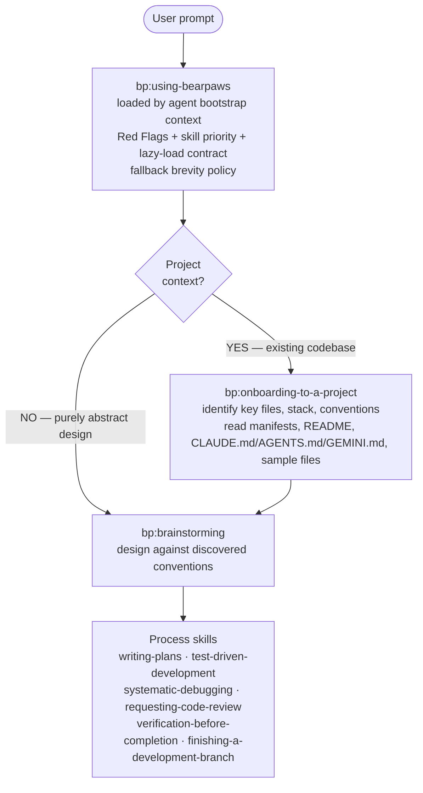

# Bearpaws

**Less context. Deliberate execution. Evidence at every gate.**

Bearpaws is a lightweight, project-aware development methodology for AI coding agents. It reads the project's conventions before changing code, scales review by risk, and loads supporting context only when needed. Built for developers who want disciplined agents with little orchestration overhead. See [Attribution](#attribution) for the project's origin and license.

Claude Code and Google Antigravity IDE are the primary supported targets. OpenCode and other Agent Skills agents (Codex, Devin, Cursor, Copilot, …) are experimental unless a specific workflow has been validated.

**15 skills** covering TDD, debugging, planning, code review, parallel execution, plus a stack-agnostic onboarding skill. All skill bodies use a compact XML-like structure with lazy-loaded references.

**How skills compose.** Standard flow when there's a project: (1) `bp:onboarding-to-a-project` identifies key files and stack from manifests, README, and similar files; (2) `bp:brainstorming` designs against those discovered conventions; (3) other process skills (writing-plans, TDD, debugging, code review) carry implementation. Onboarding → brainstorming → implementation. Onboarding is skipped only for purely abstract design questions with no project context.


```mermaid
flowchart TD
    Start([User prompt]) --> Bootstrap[bp:using-bearpaws<br/>loaded by agent bootstrap context<br/>Red Flags + skill priority + lazy-load contract<br/>fallback brevity policy]
    Bootstrap --> Check{Project<br/>context?}
    Check -->|YES &mdash; existing codebase| Onboard[bp:onboarding-to-a-project<br/>identify key files, stack, conventions<br/>read manifests, README, CLAUDE.md/AGENTS.md/GEMINI.md, sample files]
    Check -->|NO &mdash; purely abstract design| Brainstorm
    Onboard --> Brainstorm[bp:brainstorming<br/>design against discovered conventions]
    Brainstorm --> Process[Process skills<br/>writing-plans &middot; test-driven-development<br/>systematic-debugging &middot; requesting-code-review<br/>verification-before-completion &middot; finishing-a-development-branch]
```

## Support Status

| Agent | Status | Evidence |
|---|---|---|
| Claude Code | Primary | Working |
| Google Antigravity IDE | Primary | Native plugin, skills, subagents, and capability adapter |
| OpenCode | Experimental | Smoke-tested: native `.agents/skills` discovery + `instructions` bootstrap |
| Other Agent Skills agents (Codex, Devin, Cursor, Copilot, …) | Experimental | Codex discovery and activation smoke-tested with the `AGENTS.md` bootstrap; expanded conformance requires completed-action evidence. Others rely on native `.agents/skills` discovery. |

See [docs/agent-support.md](docs/agent-support.md) for the current support policy and [docs/skill-structure.md](docs/skill-structure.md) for the descriptive skill structure contract.

## Updates

Latest changes first. Full release notes live in [docs/bearpaws/release-notes/](docs/bearpaws/release-notes/).

### 2.3.1 — proposed evidence-driven roadmap follow-up

Behavior changes started from failing baselines; proposals whose baseline already passed got no skill change. See the [roadmap evaluation](docs/bearpaws/plans/2026-09-29-roadmap-evaluation.md), [continuation checklist](docs/bearpaws/plans/2026-09-30-roadmap-continuation.md), and [three-way benchmark](docs/benchmarks/2026-09-30-three-way.md).

- **Elevated-risk rule in the bootstrap.** Work touching auth, secrets, money, data deletion or migration, untrusted input reaching paths, SQL, shell, or deserialization, concurrency, or a public API needs a failing test first, an independent review, and verification evidence, however small the change. Security fixes went from 0/6 to 5/5 reviewed.
- **Risk-proportional review** in `subagent-driven-development`: routine tasks get one combined review; elevated-risk tasks keep spec review, then quality review.
- **Honest break attempts.** Reviewers label each attempt `[executed]` (ran it) or `[reasoned]` (traced it).
- **Codex bootstrap & conformance.** `./install.sh --agents --global` prints a line for `~/.codex/AGENTS.md`. The conformance suite (`tests/codex/evidence.py`, `tests/codex/run-conformance.sh`) checks 8 surfaces with completed-action evidence; Codex remains Experimental.
- **Full-session benchmark & verifier isolation** (`tests/benchmark/`): nine scenarios, three arms, acceptance checks, tokens, cost, duration, recovery, and process evidence. Seatbelt sandboxing and snapshot fingerprinting isolate checkers from tested agents on macOS. All 81 runs passed acceptance; Bearpaws cost more than both comparison arms.
- **Reviewer project conventions.** Reviews receive onboarding's conventions, with repository-guidance lookup when the controller omits them.
- **Fixes:** Code-review template placeholder alignment; Codex conformance acceptance guards against empty/skipped test discovery; session turn/token accumulation deduplication.

Trade-offs: the bootstrap grew about 770 bytes, and elevated-risk tasks cost roughly twice as much because they now get a review.

See the [2.3.1 release notes](docs/bearpaws/release-notes/2.3.1.md) for the current follow-up, verification status, and deliberate exclusions.

### 2.3.0

Current Claude Code tool names, one experimental `~/.agents/skills` installer, OpenCode support, and a shorter bootstrap. See [2.3.0 release notes](docs/bearpaws/release-notes/2.3.0.md).

## Install (Claude Code)

You can install the plugin via the Claude Code CLI:

```bash
claude plugin marketplace add /path/to/bearpaws
claude plugin install bp@bearpaws
```

Or pass it on the command line without installing: `claude --plugin-dir /path/to/bearpaws`.

## Install — Google Antigravity

Clone BearPaws:

```bash
git clone https://github.com/brandonfla/bearpaws.git
cd bearpaws
```

Install globally:

```bash
./install.sh --antigravity --global
```

BearPaws installs as a native Antigravity plugin to:
`~/.gemini/config/plugins/bearpaws/`

Restart Antigravity.

### Verify

Type:
```
/brain
```
Confirm `brainstorming` appears in the skill list.

### Update

```bash
git pull
./install.sh --antigravity --global
```

### Uninstall

```bash
rm -rf ~/.gemini/config/plugins/bearpaws
```

BearPaws uses native Antigravity plugin packaging, rules, skills, and subagents — not Gemini CLI compatibility mode.

## Experimental Install (OpenCode, Codex, Devin, Cursor, Copilot, …)

Codex, Devin, OpenCode, and other Agent Skills agents read `~/.agents/skills/`. One command links every Bearpaws skill there without touching unrelated skills:

```bash
./install.sh --agents --global
```

Restart your agent and invoke `using-bearpaws` (`skill` tool in OpenCode, `$using-bearpaws` in Codex, `/using-bearpaws` in Devin CLI) to confirm discovery. This repo also ships `.agents/skills/` (per-skill links into `skills/`) for sessions inside the checkout. Repo-local discovery through `.agents/skills` needs git symlinks enabled (`core.symlinks=true`; Developer Mode on Windows).

**OpenCode bootstrap:** merge into `~/.config/opencode/opencode.json` so the bootstrap loads every session:

```json
"instructions": ["~/.agents/skills/using-bearpaws/SKILL.md"]
```

**Codex bootstrap:** add this line to `~/.codex/AGENTS.md` so Codex loads the bootstrap every session:

```text
Before responding to any request, read `~/.agents/skills/using-bearpaws/SKILL.md` and follow it.
```

The installer prints both snippets and never edits your agent config.

Other agents load `using-bearpaws` when it is invoked or matched by its description. Devin CLI sessions in this repo also get it from `.devin/hooks.v1.json`.

Links point into your clone: `git pull` updates skills; moving or deleting the clone breaks them (re-run `./install.sh --agents --global` from the new location). Uninstall (run from the clone):

```bash
for link in ~/.agents/skills/*; do
  case "$(readlink "$link" 2>/dev/null)" in
    "$PWD/skills"/*) rm "$link" ;;
  esac
done
```

Then remove the `instructions` entry from your OpenCode config and the bootstrap line from `~/.codex/AGENTS.md`.

## Skills

### Bootstrap (1)

| Skill | Purpose |
|---|---|
| `bp:using-bearpaws` | Loaded by the target agent's bootstrap or context mechanism. Establishes skill-discovery discipline (Red Flags, lazy-load contract, skill-priority order), the elevated-risk rule (test, independent review, and evidence for risky work of any size), and a fallback brevity policy for output not governed by process skills. Never invoked directly. |

### Always-first (1)

| Skill | Purpose |
|---|---|
| `bp:onboarding-to-a-project` | **First on any work that touches the codebase.** Detect stack from manifests, read CLAUDE.md/AGENTS.md/GEMINI.md, sample existing files, find the test command. Skipped for pure ideation. |

### Process skills (13)

| Skill | Purpose |
|---|---|
| `bp:brainstorming` | Structured brainstorming before creative work |
| `bp:writing-plans` | Write implementation plans from specs |
| `bp:executing-plans` | Execute implementation plans step by step |
| `bp:test-driven-development` | TDD workflow: RED → GREEN → REFACTOR |
| `bp:systematic-debugging` | Root-cause debugging methodology |
| `bp:verification-before-completion` | Verify work before claiming completion |
| `bp:requesting-code-review` | Request code review from the reviewer agent |
| `bp:receiving-code-review` | Process and apply code review feedback |
| `bp:finishing-a-development-branch` | Ship a branch: rebase, squash, PR |
| `bp:subagent-driven-development` | Multi-agent development with spec/impl/review |
| `bp:dispatching-parallel-agents` | Run independent tasks via parallel subagents |
| `bp:using-git-worktrees` | Isolate feature work in git worktrees |
| `bp:writing-skills` | Author and test new skills (meta) |

## Token efficiency

Our aim is to mitigate token usage and enforce token efficiency while preserving practical skill-triggering usefulness. The numbers below are point-in-time measurements against superpowers `main` and will drift as either project changes — treat them as direction, not commitments.

| Metric | superpowers (main) | Bearpaws | Approx. delta |
|---|---:|---:|---|
| Bootstrap injected per session | ~5.5 KB (~1.4K tokens) | ~4.0 KB (~0.95K tokens, estimated) | ~28% smaller |
| Process skill bodies (apples-to-apples subset) | ~101 KB (~24K tokens) | ~51 KB (~12K tokens) | roughly half |

Token counts measured with `tiktoken` `cl100k_base` as a proxy for Anthropic's tokenizer (the current Bearpaws bootstrap figure uses the repository's ~0.24 tokens/byte estimate); treat them as ballpark figures, not exact savings. The bootstrap is paid every session; non-bootstrap skills load on demand through the target agent's skill mechanism, so the dominant cost is the bootstrap plus whatever skills the agent actually pulls in.

File size is only part of the cost. The [nine-scenario comparison](docs/benchmarks/2026-09-30-three-way.md) passed the original 27/27 acceptance checks in each arm: corrected cost was $0.065 per task without a plugin, $0.113 with Bearpaws, and $0.098 with Superpowers. Bearpaws dispatched reviews on four of six security tasks, with two missed gates. Stronger checks are revalidated separately in the report. These small scenarios do not demonstrate an end-to-end efficiency advantage. The tagline describes the methodology's goal, not a guarantee that every required gate will run.

## Tests

```bash
tests/schema-validator/run-validator.sh                # <1 sec — XML tag whitelist enforcement
tests/install/run-install-tests.sh                     # <2 sec — Antigravity & --agents installer tests
tests/antigravity/run-adapter-tests.sh                 # <1 sec — Antigravity adapter static assertions
python3 tests/benchmark/test_integrity.py              # <3 sec — benchmark isolation & scoring tests
python3 tests/codex/test_conformance.py                # <1 sec — Codex conformance unit tests
tests/token-measurement/measure.sh                     # <1 sec — byte counts (JSON output)
tests/skill-triggering/run-all.sh                      # ~2 min — naive-prompt triggering
tests/claude-code/run-skill-tests.sh                   # ~2 min — fast skill-content tests
tests/claude-code/run-skill-tests.sh --integration     # 10–30 min — full integration suite
tests/benchmark/run.sh                                 # ~10 min — cost per accepted task vs no plugin
tests/codex/run-conformance.sh                         # ~20 min — Codex conformance (GLOBAL=1 for the installed path)
```

## Attribution

Bearpaws originated as a fork of **[superpowers](https://github.com/obra/superpowers)** v5.0.7 by Jesse Vincent and contributors, released under the MIT license. The MIT terms and upstream copyright are preserved in [LICENSE](LICENSE); Bearpaws now develops on its own line and is not affiliated with or endorsed by the superpowers project. Release notes are in [docs/bearpaws/release-notes/](docs/bearpaws/release-notes/).

## License

MIT — see [LICENSE](LICENSE).
