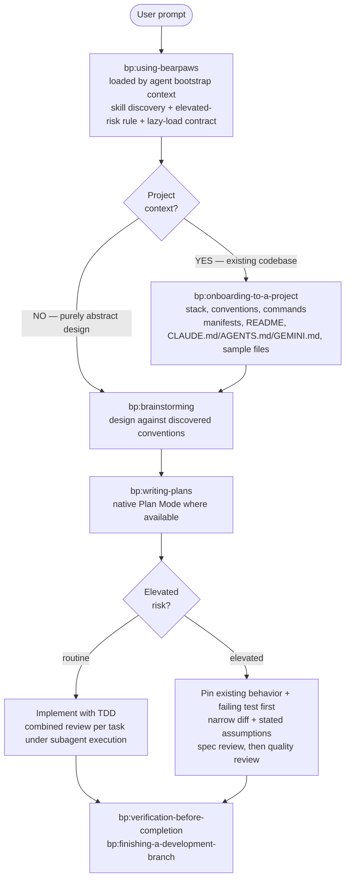

# BearPaws

**Adaptive engineering discipline for coding agents.**

BearPaws separates difficulty from danger. A change can be easy to implement and still expensive to get wrong. Elevated-risk changes get stronger testing, independent review, and verification requirements before they can be called complete. Low-risk work stays lightweight, however large it is.

Claude Code and Google Antigravity IDE are the primary supported targets. OpenCode, Grok Build, and other Agent Skills agents (Codex, Devin, Cursor, Copilot, …) are experimental unless a specific workflow has been validated. See [Attribution](#attribution) for the project's origin and license.

## Difficulty is not danger

Most agent workflows scale rigor with one question: *how complicated is this task?*

BearPaws asks a second one: *what happens if this task goes wrong?*

Those questions have different answers:

- A one-line change to authentication logic is simple to write but carries high risk.
- A 500-line UI refactor is complex but carries low risk.

A workflow that only scales with complexity misses that distinction. BearPaws treats complexity and risk as separate axes.

|  | **Low risk** | **High risk** |
|---|---|---|
| **Low complexity** | **Quick path:** implement with TDD where it applies, verify with fresh evidence | **Guarded path:** pin existing behavior, failing test for the risk first, narrow diff, stated assumptions, independent review, verification evidence |
| **High complexity** | **Structured workflow:** written plan, a fresh subagent per task, one combined review per task | **Maximum rigor:** written plan, a fresh subagent per task, spec review then quality review, a final review |

These four names are a mental model for this README. They are not labels the agent prints. The rules behind them are concrete: complexity decides whether a written plan and subagent execution are needed, and risk sets the review and evidence floor.

The deciding factor is **blast radius, not code size**:

| Change | Complexity | Potential risk | BearPaws treatment |
|---|---|---|---|
| Rename button text | Low | Low | Routine |
| Rewrite animation system | High | Low | Routine, planned |
| Change password-reset validation | Low | High | Elevated: authentication |
| Modify tenant authorization | Medium | Very high | Elevated: authorization |
| Add a database migration | Medium | High | Elevated: data migration |
| Change payment rounding | Low | High | Elevated: money |
| Refactor internal build tooling | High | Medium | Routine, planned; elevated if untrusted input reaches a shell |

Risk has two levels: routine and elevated. BearPaws does not grade it any finer. When the classification is arguable, the change is elevated.

## Why agents need this

An experienced developer slows down near an ACL check, a migration, an `rm`, a shell call, a payment calculation, or credential handling. Agents don't reliably have that instinct. A model can be equally confident about

```python
padding = 12
```

and

```python
if user.organization_id == resource.organization_id:
    allow()
```

even though the consequences of getting them wrong are wildly different.

**BearPaws doesn't rely on the model knowing when to be careful. It writes into the workflow when extra care is required.**

## Prevention and detection, in three stages

Risk mitigation is not just "run more tests." BearPaws works on two fronts:

- **Prevention** lowers the chance the agent makes a bad change at all.
- **Detection** lowers the chance a bad change is declared finished.

Higher-risk changes should have both a lower chance of failure and a lower chance of undetected failure.

**1. Before implementation (prevention).**
- Onboarding reads the project's conventions, commands, and constraints.
- The change is classified against sensitive surfaces:
  - authentication or authorization
  - secrets or cryptography
  - money
  - data deletion or migration
  - untrusted input reaching filesystem paths, SQL, shell, or deserialization
  - concurrency
  - a public API or schema
- That classification sets a minimum process floor. Size never lowers it, and the implementer can't downgrade a task halfway through because it "looks easy."

**2. During implementation (prevention).** Elevated-risk work follows stronger constraints:
- **Prove the existing behavior.** Tests pin the behavior that must not change, and the agent runs them and sees them pass before editing.
- **Fail first.** A failing test for the risk is written and watched failing before the fix.
- **Narrow change.** The diff is limited to the fix, with no unrelated cleanup.
- **Explicit assumptions.** The report lists what the agent took as true without checking, so a reviewer can challenge it.
- **Separation.** Implementation and review are done by different agents.

Non-trivial work also follows an explicit plan. In Claude Code that plan is made read-only in native Plan Mode.

**3. After implementation (detection).** Evidence replaces confidence:
- Tests must actually run, fresh, with their output read.
- Elevated-risk work needs an independent review. A missing review makes the outcome INCOMPLETE, never done.
- Reviewers try to break the change and label each attempt `[executed]` or `[reasoned]`, so it's clear what was actually run.

Most agent workflows end with:

> **Agent:** "I changed the code and everything looks good."

BearPaws ends with:

> **Agent:** "I changed the code."
> **BearPaws:** "Show me."

For risky work, "show me" means:
1. The tests that pin current behavior, passing before the change.
2. The failing test before the fix.
3. The passing tests after it.
4. The relevant checks.
5. A review by someone other than the implementer.

Superpowers-style rigor answers *how do we engineer this correctly?* BearPaws adds *how much proof do we need before we trust this change?*

### What this does not guarantee

These rules are instructions to the agent, not enforcement by the harness. Results so far:

- In the 2.3.1 A/B work, the elevated-risk rule raised reviewed security fixes from 0/6 to 5/5.
- In the later [nine-scenario benchmark](docs/benchmarks/2026-09-30-three-way.md), reviews ran on four of six security tasks.

The gates usually hold, but not always. Rigor also costs tokens: elevated-risk tasks cost roughly twice as much because they get a review.

## How it works

**15 skills** cover onboarding, brainstorming, planning, TDD, debugging, code review, verification, and parallel execution. The standard flow on a project is:

1. Onboard to the project.
2. Design against its conventions.
3. Plan.
4. Implement with risk-proportional review and verification.

Onboarding is skipped only for purely abstract design questions with no project context.


```mermaid
flowchart TD
    Start([User prompt]) --> Bootstrap[bp:using-bearpaws<br/>loaded by agent bootstrap context<br/>skill discovery + elevated-risk rule + lazy-load contract]
    Bootstrap --> Check{Project<br/>context?}
    Check -->|YES &mdash; existing codebase| Onboard[bp:onboarding-to-a-project<br/>stack, conventions, commands<br/>manifests, README, CLAUDE.md/AGENTS.md/GEMINI.md, sample files]
    Check -->|NO &mdash; purely abstract design| Brainstorm
    Onboard --> Brainstorm[bp:brainstorming<br/>design against discovered conventions]
    Brainstorm --> Plan[bp:writing-plans<br/>native Plan Mode where available]
    Plan --> Risk{Elevated<br/>risk?}
    Risk -->|routine| Light[Implement with TDD<br/>combined review per task under subagent execution]
    Risk -->|elevated| Strong[Pin existing behavior + failing test first<br/>narrow diff + stated assumptions<br/>spec review, then quality review]
    Light --> Verify[bp:verification-before-completion<br/>bp:finishing-a-development-branch]
    Strong --> Verify
```

Other principles:

- **Deliberate.** Planning and implementation stay separate where that improves reliability. In Claude Code, your plan approval hands off to execution after the plan is saved, with no second confirmation.
- **Context-efficient.** Skills and references load only when needed. See [Design principles](#design-principles-why-the-architecture-is-lightweight).
- **Harness-independent.** Skills define the methodology. Adapters map it onto each agent's native capabilities. The bootstrap reaches each agent in the way it supports:
  - a SessionStart hook (Claude Code, Copilot CLI, Cursor, Devin CLI);
  - a plugin rule (Antigravity);
  - a rules file the installer writes (Grok Build);
  - a one-line instruction you add (Codex, OpenCode).

  `tests/harness-wiring/` checks this wiring without calling a model.

## BearPaws vs. Superpowers

[Superpowers](https://github.com/obra/superpowers) gives coding agents a rigorous, consistent engineering process. BearPaws began as a fork of it and builds on that philosophy with a more adaptive model:

> Superpowers gives every task a rigorous workflow. BearPaws makes the workflow fit the task, scaled by blast radius rather than code size.

This is a difference in design, not a measured cost advantage. In the current nine-scenario benchmark, BearPaws cost more per task than both Superpowers and no plugin.

## Support Status

| Agent | Status | Evidence |
|---|---|---|
| Claude Code | Primary | Working |
| Google Antigravity IDE | Primary | Native plugin, skills, subagents, and capability adapter |
| OpenCode | Experimental | Wiring checked in CI: repo-level and global `.agents/skills` discovery, `instructions` bootstrap resolves; live bootstrap smoke-tested |
| Grok Build | Experimental | `./install.sh --grok --global`; `grok inspect` lists the bootstrap rule and all skills (1.0.45, built from source); no live session run |
| Other Agent Skills agents (Codex, Devin, Cursor, Copilot, …) | Experimental | Codex skills and `AGENTS.md` bootstrap checked in CI, activation smoke-tested; Copilot CLI installs the plugin (CI); Devin and Cursor hook payloads follow their docs, unverified live. Expanded conformance requires completed-action evidence. |

See [docs/agent-support.md](docs/agent-support.md) for the current support policy and [docs/skill-structure.md](docs/skill-structure.md) for the descriptive skill structure contract.

## Updates

Latest changes first. Full release notes live in [docs/bearpaws/release-notes/](docs/bearpaws/release-notes/).

### 2.5.0 — other-harness cleanup and Grok Build

- **Grok Build (experimental).** `./install.sh --grok --global` links skills and writes a bootstrap rule to `~/.grok/rules/bearpaws.md`. Grok ignores SessionStart hook output, so a rule is the bootstrap.
- **Devin hook fix.** The SessionStart hook now sends Devin the nested `hookSpecificOutput` shape Devin documents, instead of a top-level key.
- **Cursor packaging.** `.cursor-plugin/plugin.json` makes the hook's existing Cursor branch reachable.
- **Model-free wiring checks in CI.** Codex, OpenCode, and Copilot CLI are installed at pinned versions and asked what they loaded. No API keys needed.
- **Tests that were silently broken.** The Antigravity adapter test could never pass, and the schema validator crashed under a non-UTF-8 locale. Both are fixed, and both now run in CI with the hook and installer tests.

See the [2.5.0 release notes](docs/bearpaws/release-notes/2.5.0.md).

### 2.4.0 — Claude Code native planning

- **Native Plan Mode.** `bp:writing-plans` plans read-only inside Claude Code's Plan Mode.
- **Stronger elevated-risk floor.** Elevated-risk work now pins behavior that must not change before editing, keeps the diff to the fix, and lists its assumptions. In a new authorization eval, all 5 runs pinned 5 behaviors before editing (the baseline pinned 2), and all 5 listed assumptions (baseline 0/3).
- **No second confirmation.** Your approval is the go-ahead. The agent sets up the workspace, saves the plan to `docs/bearpaws/plans/`, then invokes `bp:subagent-driven-development` or `bp:executing-plans`.
- **Before and after.** Before this change, approved plans were coded inline with no saved plan and no execution skill. After it, both happen, in single runs on Opus-then-Sonnet and on Sonnet only.
- **Model choice stays with Claude Code.** `/model opusplan` is a supported pairing, BearPaws adds no hook or model logic, and portable skills stay model-neutral.

See the [2.4.0 release notes](docs/bearpaws/release-notes/2.4.0.md).

### 2.3.1 — proposed evidence-driven roadmap follow-up

Behavior changes started from failing baselines; proposals whose baseline already passed got no skill change. See the [roadmap evaluation](docs/bearpaws/plans/2026-09-29-roadmap-evaluation.md), [continuation checklist](docs/bearpaws/plans/2026-09-30-roadmap-continuation.md), and [three-way benchmark](docs/benchmarks/2026-09-30-three-way.md).

- **Elevated-risk rule in the bootstrap.** Work touching auth, secrets, money, data deletion or migration, untrusted input reaching paths, SQL, shell, or deserialization, concurrency, or a public API needs a failing test first, an independent review, and verification evidence, however small the change. Security fixes went from 0/6 to 5/5 reviewed.
- **Risk-proportional review** in `subagent-driven-development`: routine tasks get one combined review; elevated-risk tasks keep spec review, then quality review.
- **Honest break attempts.** Reviewers label each attempt `[executed]` (ran it) or `[reasoned]` (traced it).
- **Codex bootstrap & conformance.** `./install.sh --agents --global` prints a line for `~/.codex/AGENTS.md`. The conformance suite (`tests/codex/evidence.py`, `tests/codex/run-conformance.sh`) checks 8 surfaces with completed-action evidence; Codex remains Experimental.
- **Full-session benchmark & verifier isolation** (`tests/benchmark/`): nine scenarios, three arms, acceptance checks, tokens, cost, duration, recovery, and process evidence. Seatbelt sandboxing and snapshot fingerprinting isolate checkers from tested agents on macOS. All 81 runs passed acceptance; BearPaws cost more than both comparison arms.
- **Reviewer project conventions.** Reviews receive onboarding's conventions, with repository-guidance lookup when the controller omits them.
- **Fixes:** Code-review template placeholder alignment; Codex conformance acceptance guards against empty/skipped test discovery; session turn/token accumulation deduplication.

Trade-offs: the bootstrap grew about 770 bytes, and elevated-risk tasks cost roughly twice as much because they now get a review.

See the [2.3.1 release notes](docs/bearpaws/release-notes/2.3.1.md) for the current follow-up, verification status, and deliberate exclusions.

### 2.3.0

Current Claude Code tool names, one experimental `~/.agents/skills` installer, OpenCode support, and a shorter bootstrap. See [2.3.0 release notes](docs/bearpaws/release-notes/2.3.0.md).

## Install (Claude Code)

You can install the plugin via the Claude Code CLI:

```bash
claude plugin marketplace add /path/to/bearpaws
claude plugin install bp@bearpaws
```

Or pass it on the command line without installing: `claude --plugin-dir /path/to/bearpaws`.

### Recommended Claude Code setup

For non-trivial work, BearPaws pairs well with Claude Code's built-in `/model opusplan` setting: Claude Code uses Opus in native Plan Mode and Sonnet for execution, in the same session. BearPaws governs how planning and implementation are done; Claude Code chooses the model for each phase. `opusplan` is recommended, not required, and BearPaws never switches models itself.

```text
Plan Mode: bp:writing-plans (read-only) -> you approve -> plan saved to docs/bearpaws/plans/ -> subagent-driven-development or executing-plans -> review + verification
```

Plan approval counts as the go-ahead; BearPaws does not ask a second time. See [`skills/using-bearpaws/references/claude-code.md`](skills/using-bearpaws/references/claude-code.md).

## Install — Google Antigravity

Clone BearPaws:

```bash
git clone https://github.com/brandonfla/bearpaws.git
cd bearpaws
```

Install globally:

```bash
./install.sh --antigravity --global
```

BearPaws installs as a native Antigravity plugin to:
`~/.gemini/config/plugins/bearpaws/`

Restart Antigravity.

### Verify

Type:
```
/brain
```
Confirm `brainstorming` appears in the skill list.

### Update

```bash
git pull
./install.sh --antigravity --global
```

### Uninstall

```bash
rm -rf ~/.gemini/config/plugins/bearpaws
```

BearPaws uses native Antigravity plugin packaging, rules, skills, and subagents — not Gemini CLI compatibility mode.

## Experimental Install (OpenCode, Codex, Grok Build, Devin, Cursor, Copilot, …)

Codex, Devin, OpenCode, and other Agent Skills agents read `~/.agents/skills/`. One command links every BearPaws skill there without touching unrelated skills:

```bash
./install.sh --agents --global
```

Restart your agent and invoke `using-bearpaws` (`skill` tool in OpenCode, `$using-bearpaws` in Codex, `/using-bearpaws` in Devin CLI) to confirm discovery. This repo also ships `.agents/skills/` (per-skill links into `skills/`) for sessions inside the checkout. Repo-local discovery through `.agents/skills` needs git symlinks enabled (`core.symlinks=true`; Developer Mode on Windows).

**OpenCode bootstrap:** merge into `~/.config/opencode/opencode.json` so the bootstrap loads every session:

```json
"instructions": ["~/.agents/skills/using-bearpaws/SKILL.md"]
```

**Codex bootstrap:** add this line to `~/.codex/AGENTS.md` so Codex loads the bootstrap every session:

```text
Before responding to any request, read `~/.agents/skills/using-bearpaws/SKILL.md` and follow it.
```

The installer prints both snippets and never edits your agent config.

**Grok Build:** one command links the skills and adds a bootstrap rule that Grok loads in every project:

```bash
./install.sh --grok --global      # writes ~/.grok/rules/bearpaws.md ($GROK_HOME/rules/ if set)
grok inspect                      # confirm the rule and skills are listed
```

The installer only writes a `bearpaws.md` it owns, and it refuses to overwrite one you wrote.

**Copilot CLI:** installs from the same plugin marketplace as Claude Code, with skills plus a SessionStart hook:

```bash
copilot plugin marketplace add /path/to/bearpaws
copilot plugin install bp@bearpaws
```

**Cursor:** the repo ships `.cursor-plugin/plugin.json` (skills plus a `sessionStart` hook). It has not been verified in Cursor.

**Devin CLI:** reads `~/.agents/skills`. Put the Codex bootstrap line in your project's `AGENTS.md`. Sessions inside this repo also get the bootstrap from `.devin/hooks.v1.json`.

Other agents load `using-bearpaws` when it is invoked or matched by its description.

Links point into your clone: `git pull` updates skills; moving or deleting the clone breaks them (re-run `./install.sh --agents --global` from the new location). Uninstall (run from the clone):

```bash
for link in ~/.agents/skills/*; do
  case "$(readlink "$link" 2>/dev/null)" in
    "$PWD/skills"/*) rm "$link" ;;
  esac
done
```

Then remove the `instructions` entry from your OpenCode config, the bootstrap line from `~/.codex/AGENTS.md`, and `~/.grok/rules/bearpaws.md`.

## Skills

### Bootstrap (1)

| Skill | Purpose |
|---|---|
| `bp:using-bearpaws` | Loaded by the target agent's bootstrap or context mechanism. Establishes skill-discovery discipline (Red Flags, lazy-load contract, skill-priority order), the elevated-risk rule (test, independent review, and evidence for risky work of any size), and a fallback brevity policy for output not governed by process skills. Never invoked directly. |

### Always-first (1)

| Skill | Purpose |
|---|---|
| `bp:onboarding-to-a-project` | **First on any work that touches the codebase.** Detect stack from manifests, read CLAUDE.md/AGENTS.md/GEMINI.md, sample existing files, find the test command. Skipped for pure ideation. |

### Process skills (13)

| Skill | Purpose |
|---|---|
| `bp:brainstorming` | Structured brainstorming before creative work |
| `bp:writing-plans` | Write implementation plans from specs |
| `bp:executing-plans` | Execute implementation plans step by step |
| `bp:test-driven-development` | TDD workflow: RED → GREEN → REFACTOR |
| `bp:systematic-debugging` | Root-cause debugging methodology |
| `bp:verification-before-completion` | Verify work before claiming completion |
| `bp:requesting-code-review` | Request code review from the reviewer agent |
| `bp:receiving-code-review` | Process and apply code review feedback |
| `bp:finishing-a-development-branch` | Ship a branch: rebase, squash, PR |
| `bp:subagent-driven-development` | Multi-agent development with spec/impl/review |
| `bp:dispatching-parallel-agents` | Run independent tasks via parallel subagents |
| `bp:using-git-worktrees` | Isolate feature work in git worktrees |
| `bp:writing-skills` | Author and test new skills (meta) |

## Design principles: why the architecture is lightweight

Process should cost context only when it earns it. The bootstrap is paid every session, so it stays small. Every other skill and reference loads on demand through the agent's own skill mechanism. Skill bodies use a compact XML-like structure.

The numbers below are point-in-time measurements against superpowers `main` and will drift as either project changes. Treat them as direction, not commitments.

| Metric | superpowers (main) | BearPaws | Approx. delta |
|---|---:|---:|---|
| Bootstrap injected per session | ~5.5 KB (~1.4K tokens) | ~4.2 KB (~1.0K tokens, estimated) | ~24% smaller |
| Process skill bodies (apples-to-apples subset) | ~101 KB (~24K tokens) | ~51 KB (~12K tokens) | roughly half |

Token counts were measured with `tiktoken` `cl100k_base` as a proxy for Anthropic's tokenizer. The current BearPaws bootstrap figure uses the repository's ~0.24 tokens/byte estimate. Treat them as ballpark figures, not exact savings.

File size is only part of the cost. The [nine-scenario comparison](docs/benchmarks/2026-09-30-three-way.md) passed the original 27/27 acceptance checks in each arm. Corrected cost per task was $0.065 without a plugin, $0.113 with BearPaws, and $0.098 with Superpowers. BearPaws dispatched reviews on four of six security tasks, with two missed gates. Stronger checks are revalidated separately in the report. These small scenarios do not demonstrate an end-to-end efficiency advantage.

## Tests

```bash
tests/schema-validator/run-validator.sh                # <1 sec — XML tag whitelist enforcement
tests/install/run-install-tests.sh                     # <2 sec — Antigravity, --agents & --grok installer tests
tests/hooks/run-hook-tests.sh                          # <1 sec — SessionStart payload shape per harness
tests/harness-wiring/run.sh                            # ~15 sec — model-free wiring checks for installed codex/opencode/copilot/grok
tests/antigravity/run-adapter-tests.sh                 # <1 sec — Antigravity adapter static assertions
python3 tests/benchmark/test_integrity.py              # <3 sec — benchmark isolation & scoring tests
python3 tests/codex/test_conformance.py                # <1 sec — Codex conformance unit tests
tests/token-measurement/measure.sh                     # <1 sec — byte counts (JSON output)
tests/skill-triggering/run-all.sh                      # ~2 min — naive-prompt triggering
tests/claude-code/run-skill-tests.sh                   # ~5 min — fast skill-content + native Plan Mode tests
tests/claude-code/run-skill-tests.sh --integration     # 10–30 min — full integration suite
tests/risk-eval/run.sh skills/using-bearpaws/SKILL.md <label>  # ~3 min — elevated-risk floor (pin, narrow diff, assumptions)
tests/benchmark/run.sh                                 # ~10 min — cost per accepted task vs no plugin
tests/codex/run-conformance.sh                         # ~20 min — Codex conformance (GLOBAL=1 for the installed path)
```

## Attribution

BearPaws originated as a fork of **[superpowers](https://github.com/obra/superpowers)** v5.0.7 by Jesse Vincent and contributors, released under the MIT license. The MIT terms and upstream copyright are preserved in [LICENSE](LICENSE); BearPaws now develops on its own line and is not affiliated with or endorsed by the superpowers project. Release notes are in [docs/bearpaws/release-notes/](docs/bearpaws/release-notes/).

## License

MIT — see [LICENSE](LICENSE).
